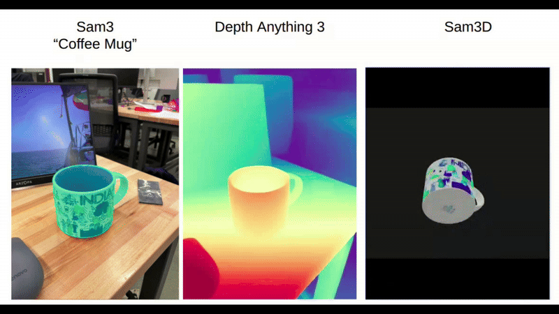

<div align="center">

# **ARC**  
### Aligned Reconstruction for Contact Grasping

*Intelligent 3D reconstruction and robotic grasping from a single image.*

[](https://www.python.org/) 
[](https://www.docker.com/)
[](LICENSE)

</div>





## Overview

ARC combines three state-of-the-art vision models into a unified system:

- **SAM3D** - 3D object reconstruction from images
- **SAM3** - 2D instance segmentation with text prompts
- **Depth Anything V3** - Monocular depth estimation

All three models run in parallel Docker containers with GPU acceleration, accessible via REST APIs.

## Quick Start

### Prerequisites

- Docker with NVIDIA GPU support
- Python 3.10+
- Hugging Face token (for model downloads)

### Setup & Run Servers

```bash
# 1. Export your Hugging Face token
export HF_TOKEN=hf_your_token_here

# 2. One-command setup (builds image, starts containers, verifies health)
make quickstart

# Wait 2-5 minutes for models to load on first run
# Subsequent restarts: 30-60 seconds

# 3. Check logs
make logs
```

### Test with Client (GUI)

```bash
# Test all 3 models locally
make client SERVER_IP=localhost

# Test remote server
make client SERVER_IP=192.168.1.100

# Custom test
source .venv/bin/activate
python3 arc_client_gui.py --server-ip 192.168.1.100 --image test.jpg --all
```

The GUI client displays:
- **SAM3** segmentation masks (individual + overlay)
- **Depth** maps (raw + colorized + uncertainty)
- **SAM3D** interactive 3D mesh/point cloud viewer

## Architecture

### Docker Container
Single container with 3 servers running in parallel:

```
Port 8000: SAM3D Server     (3D Reconstruction)
Port 8001: SAM3 Server      (2D Segmentation)
Port 8002: Depth Server     (Depth Estimation)
```

### REST API Endpoints

**SAM3** - 2D Segmentation
```bash
POST http://server:8001/segment-with-prompt
{
  "image": "base64_encoded_image",
  "prompt": "object",
  "confidence_threshold": 0.80
}
```

**Depth** - Depth Estimation
```bash
POST http://server:8002/depth-with-confidence
{
  "image": "base64_encoded_image"
}
```

**SAM3D** - 3D Reconstruction
```bash
POST http://server:8000/reconstruct
{
  "image": "base64_encoded_image",
  "mask": "base64_encoded_mask"
}
```

## Makefile Commands

| Command | Description |
|---------|-------------|
| `make quickstart` | Setup + build + start servers (full initialization) |
| `make build` | Build Docker image |
| `make up` | Start containers |
| `make down` | Stop containers |
| `make logs` | View server logs |
| `make shell` | Enter container shell |
| `make ps` | Show running containers |
| `make client SERVER_IP=X` | Run GUI test client |
| `make client-install` | Install Python venv + dependencies |
| `make clean` | Stop and remove containers/images |

## Project Structure

```
ARC/
├── Dockerfile              # Multi-model container image
├── docker-compose.yml      # Container orchestration
├── Makefile               # Automation targets
├── arc_client.py          # File-saving client
├── arc_client_gui.py      # GUI-only client (recommended)
├── sam3d_server.py        # SAM3D REST server
├── sam3_server.py         # SAM3 REST server
├── depth_anything_v3_server.py  # Depth server
├── test.jpg               # Sample test image
└── .cache/                # Model cache (auto-created)
```

## Model Info

| Model | Size | Speed | Output |
|-------|------|-------|--------|
| SAM3D | ~2GB | ~5-10s | 3D mesh or point cloud |
| SAM3 | ~1GB | ~2-5s | Instance segmentation masks |
| Depth V3 | ~1.5GB | ~2-3s | Depth map + uncertainty |

## Tips

- **First run takes 5-10 min** (models download + load)
- **Subsequent runs: 30-60 sec** (models cached)
- **GPU recommended** - CPU inference much slower
- **Remote testing** - Pass `SERVER_IP=remote_ip` to client
- **Custom prompts** - Use `--prompt "your prompt"` with SAM3/SAM3D

## Troubleshooting

**Servers not responding?**
```bash
make logs  # Check if models are still loading
```

**Out of memory?**
```bash
# Reduce batch sizes in server files
# Or use a machine with more VRAM (8GB+ recommended)
```

**Connection refused?**
```bash
# Make sure container is running
make ps

# Restart if needed
make down && make up
```

## Citation

@article{sam3dteam2025sam3d3dfyimages,
      title={SAM 3D: 3Dfy Anything in Images}, 
      author={SAM 3D Team and Xingyu Chen and Fu-Jen Chu and Pierre Gleize and Kevin J Liang and Alexander Sax and Hao Tang and Weiyao Wang and Michelle Guo and Thibaut Hardin and Xiang Li and Aohan Lin and Jiawei Liu and Ziqi Ma and Anushka Sagar and Bowen Song and Xiaodong Wang and Jianing Yang and Bowen Zhang and Piotr Dollár and Georgia Gkioxari and Matt Feiszli and Jitendra Malik},
      year={2025},
      eprint={2511.16624},
      archivePrefix={arXiv},
      primaryClass={cs.CV},
      url={https://arxiv.org/abs/2511.16624}, 
}

@misc{carion2025sam3segmentconcepts,
      title={SAM 3: Segment Anything with Concepts},
      author={Nicolas Carion and Laura Gustafson and Yuan-Ting Hu and Shoubhik Debnath and Ronghang Hu and Didac Suris and Chaitanya Ryali and Kalyan Vasudev Alwala and Haitham Khedr and Andrew Huang and Jie Lei and Tengyu Ma and Baishan Guo and Arpit Kalla and Markus Marks and Joseph Greer and Meng Wang and Peize Sun and Roman Rädle and Triantafyllos Afouras and Effrosyni Mavroudi and Katherine Xu and Tsung-Han Wu and Yu Zhou and Liliane Momeni and Rishi Hazra and Shuangrui Ding and Sagar Vaze and Francois Porcher and Feng Li and Siyuan Li and Aishwarya Kamath and Ho Kei Cheng and Piotr Dollár and Nikhila Ravi and Kate Saenko and Pengchuan Zhang and Christoph Feichtenhofer},
      year={2025},
      eprint={2511.16719},
      archivePrefix={arXiv},
      primaryClass={cs.CV},
      url={https://arxiv.org/abs/2511.16719},
}

@article{depthanything3,
  title={Depth Anything 3: Recovering the visual space from any views},
  author={Haotong Lin and Sili Chen and Jun Hao Liew and Donny Y. Chen and Zhenyu Li and Guang Shi and Jiashi Feng and Bingyi Kang},
  journal={arXiv preprint arXiv:2511.10647},
  year={2025}
}

## License

See LICENSE file for details.
